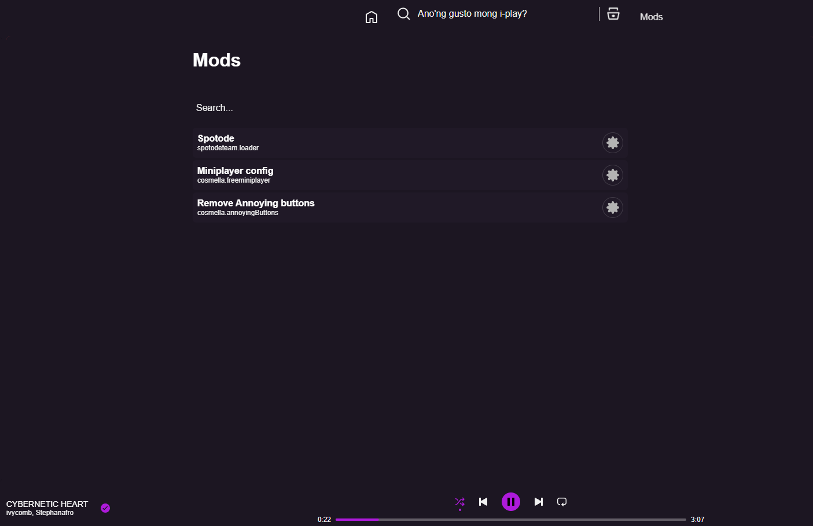
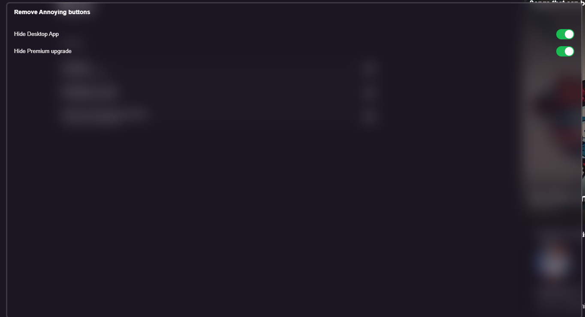

# A spotify chrome extension that allows modders to interact with the spotify apis and implements a new mod menu!
## here is a example of some UI currently present within this project

# Languages:
- Javascript main framework for hooking
- Lua for the build time scripting
- CSS For themes
- Json for css map bindings

